Atomic opacities
================

In this section we show all available atomic opacities from the NIST and
Kurucz database. We use T = 3000 K and P = 1 bar.

.. figure:: ../plots/atomic/plotB00.png  
   :name: atomic00

.. figure:: ../plots/atomic/plotB01.png  
   :name: atomic01

.. figure:: ../plots/atomic/plotB02.png  
   :name: atomic02

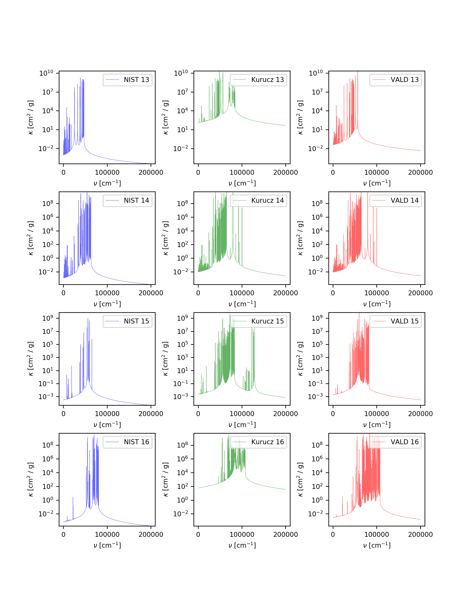

.. figure:: ../plots/atomic/plotB04.png  
   :name: atomic04

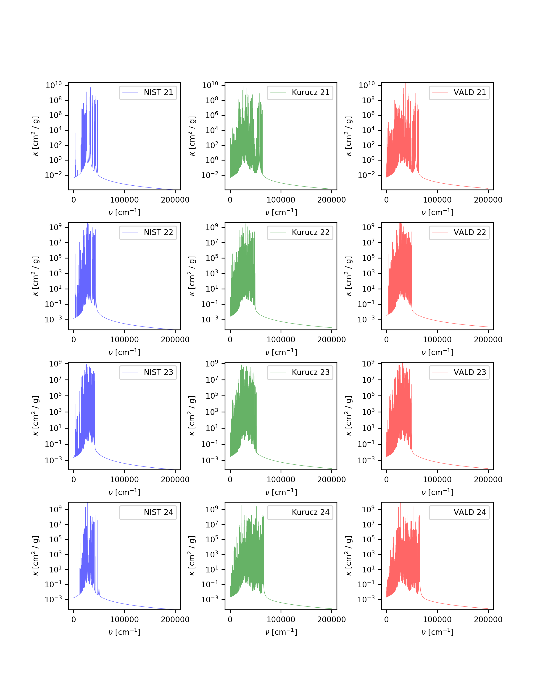

.. figure:: ../plots/atomic/plotB06.png  
   :name: atomic06

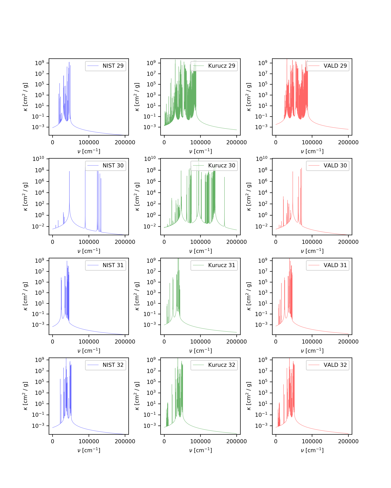

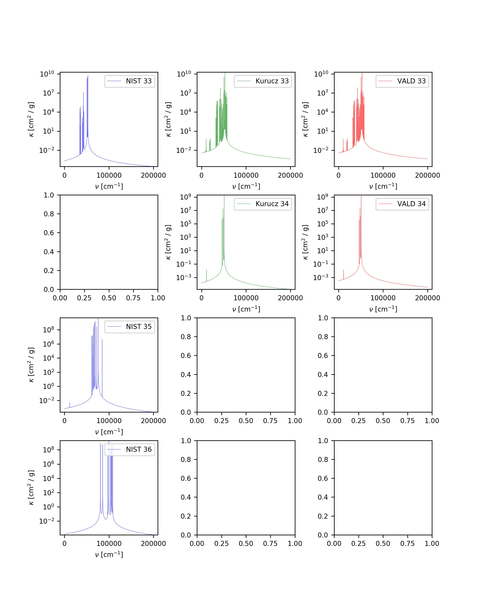

.. figure:: ../plots/atomic/plotB09.png  
   :name: atomic09

.. figure:: ../plots/atomic/plotB10.png  
   :name: atomic10

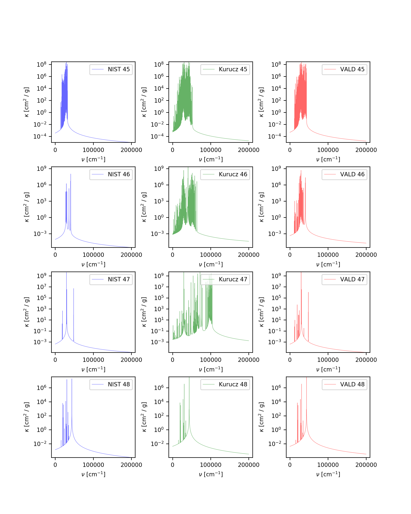

.. figure:: ../plots/atomic/plotB12.png  
   :name: atomic12

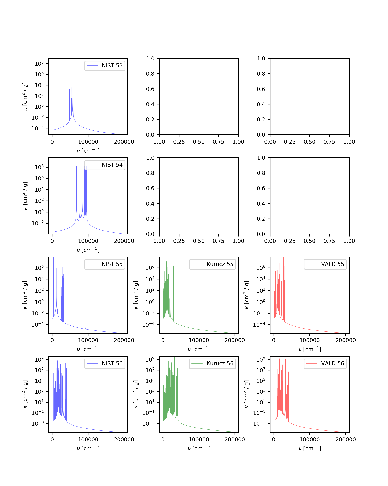

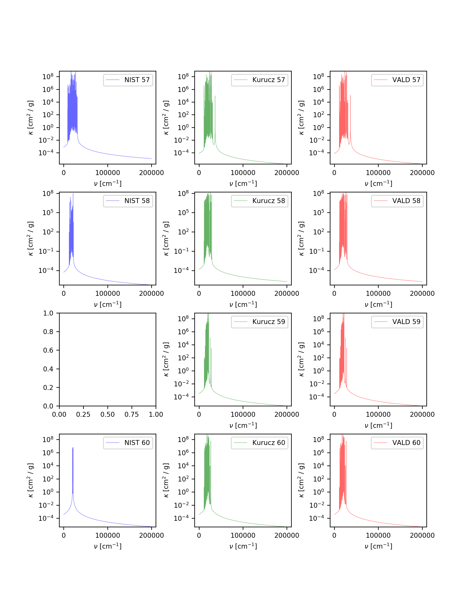

.. figure:: ../plots/atomic/plotB15.png  
   :name: atomic15

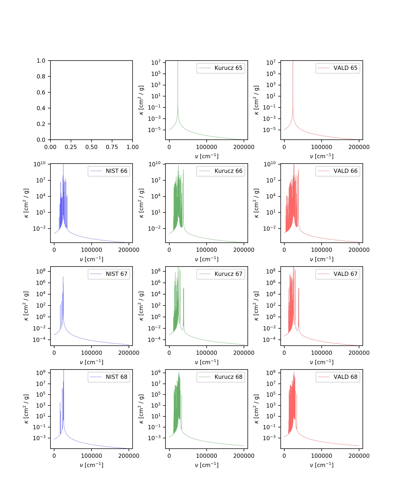

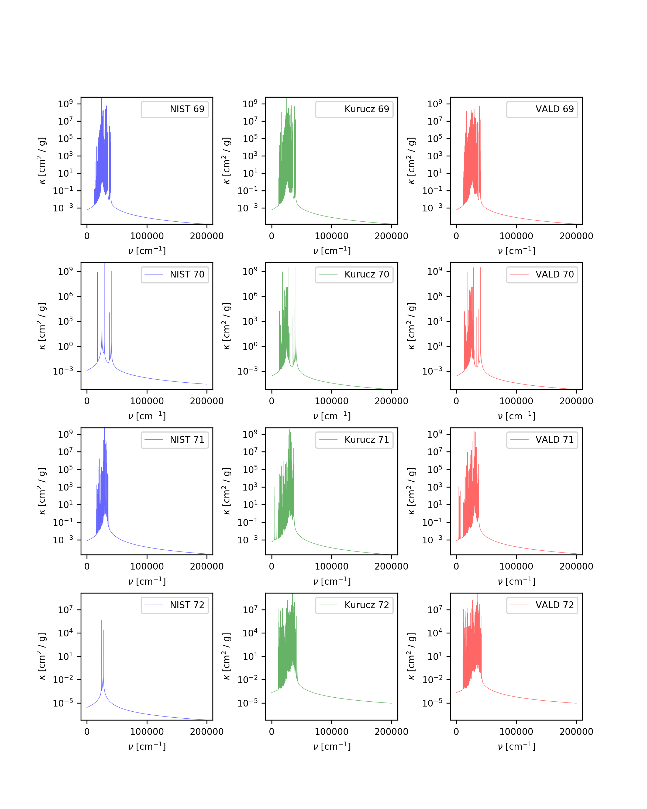

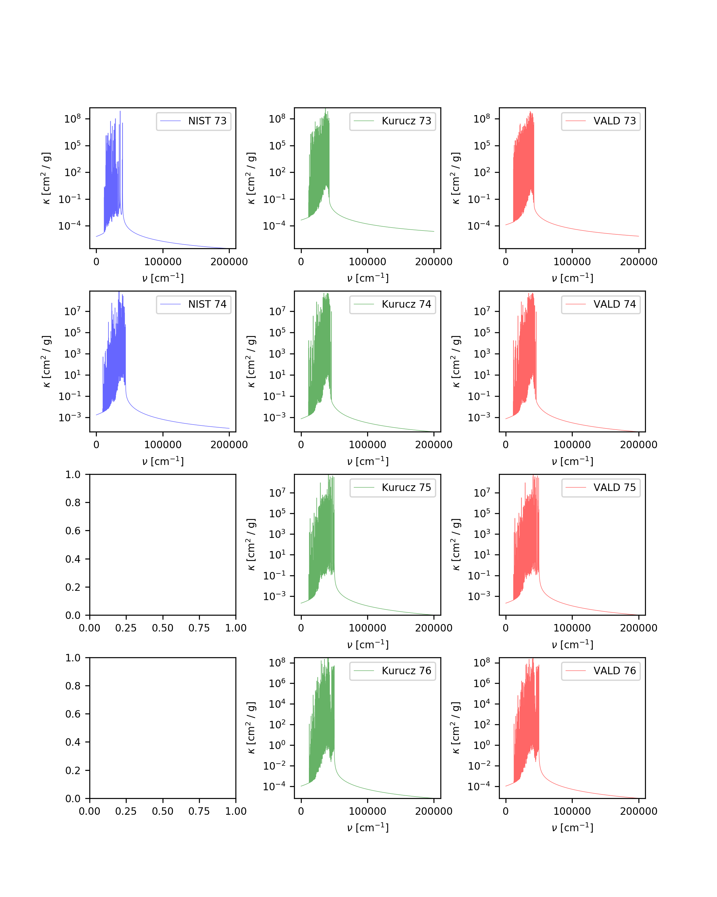

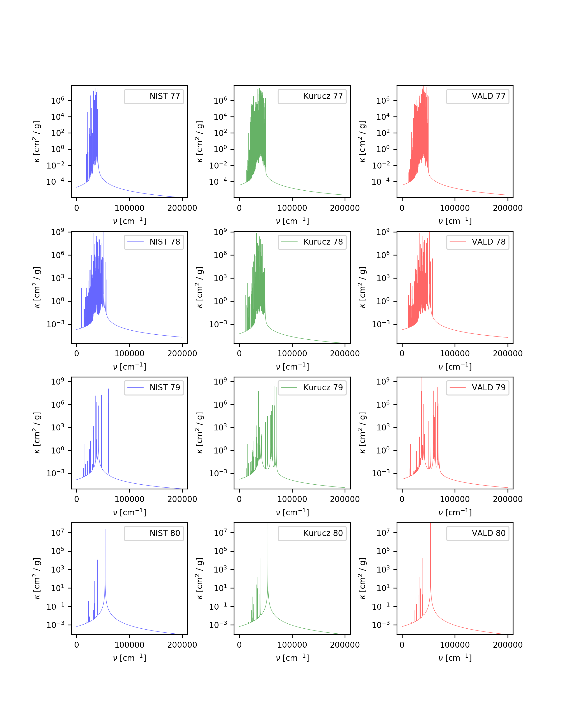

.. figure:: ../plots/atomic/plotB20.png  
   :name: atomic20
    
.. figure:: ../plots/atomic/plotB21.png  
   :name: atomic21

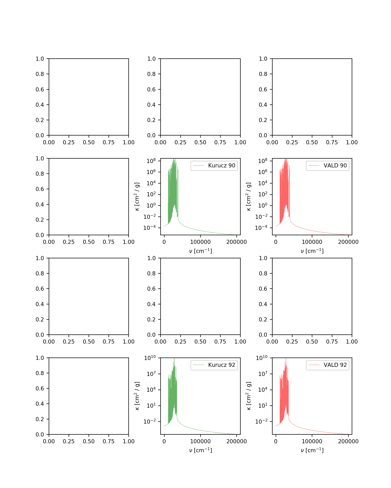

