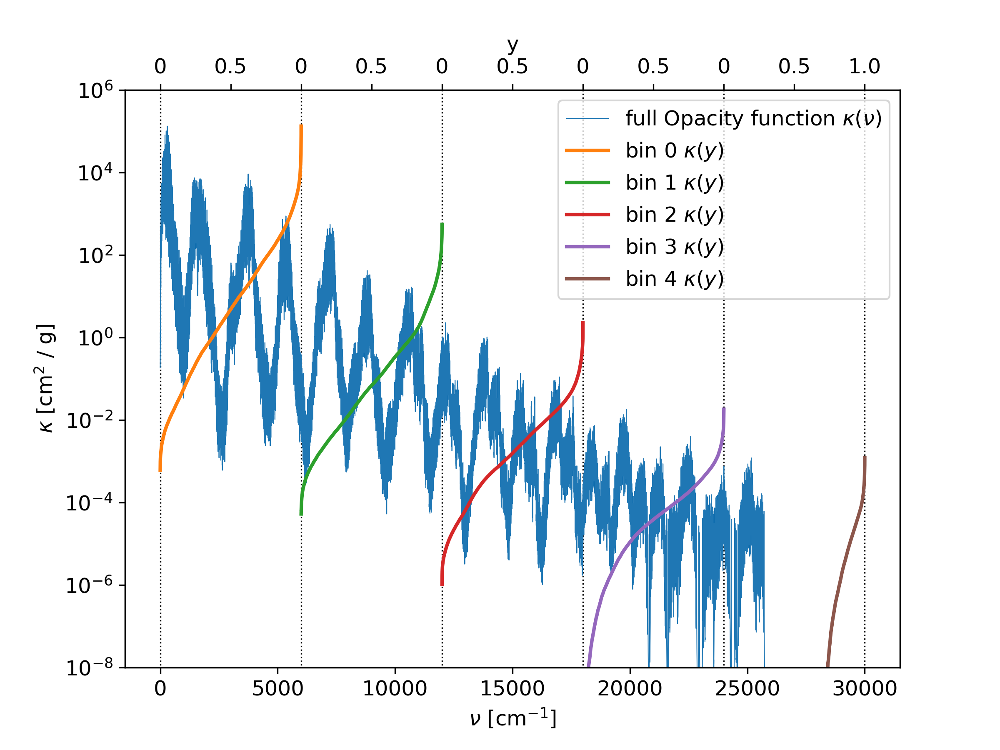

Bins
====

Bins devide the total range of wavenumbers into equal size or not-equal sized 
ranges. Inside the bins, the values of the opacity function can be compacted 
into a more lightweight format, in order to same memory space. An example is
shown in :numref:`figbin`, where the wavenumber range from 0 30000 cm^-1 is 
divided into fife bins. Inside of each bin, the opacity function is sorted
from small to large, and mapped to a new parameter y, rangin from 0 to 1. 
When the opcity function has empty parts inside or is not ranging to the full
bin width, then the sorted opacity function is zero (or kmin, if used) on the
lower part.
| Relevant parameters for this example:

 - doResampling = 0
 - doStoreFullK = 1
 - doStoreSK = 2
 - nbins = 5

 

   The opacity function is divided into fife bins. Inside each bin, the opacity
   function is sorted and mapped to a new paramter y, ranging from 0 to 1.
    

Using a binsfile
----------------

When a ``binsFile`` name is given in the ``param.dat`` file, then this
file is used to generate the boundaries of the bins. The bins do not have
to be equal sized. 
| Note that this option does not support the doResampling and
doTransmission options.
| The binsfile must contain line by line the boundaries of the bins in cm^-1.

An example of a ``binsFile`` is given below, and the result is shown in :numref:`figbinfile`.

::

   bins.dat
   --------
   2000
   6000
   12000
   15000
   25000
   30000

| Relevant parameters for this example:

 - doResampling = 0
 - doStoreFullK = 1
 - doStoreSK = 2
 - binsFile = bins.dat

.. figure:: ../plots/p002/plot001.png  
   :name: figbinfile

   The opacity function is divided into fife bins, according to the entries of the binsfile. 
   Inside each bin, the opacity function is sorted and mapped to a new paramter y, ranging
   from 0 to 1.

The output edges option
-----------------------

Instead of writing the -per bin sorted- opacity function with the full resolution in
wavenumbers, it is possible to print only averaged positions within the bins. 
For doing that, the ``outputedgesFile`` option in the ``param.dat`` file can be used. 
In that file, the edges of the averaged regions within a bin can be specified. 
The output possition of the sorted opacity function is then exaclty in between of the
edges. The edges must have values between 0 and 1. 

An example of a ``outputedgesFile`` is given below, and the result is shown in
:numref:`figbinedges`. Note that the figure is plotted in log scale, therefore
the averaged points can appear to have too high values. 

::

   edges.dat
   ---------
   0.0
   0.1
   0.45
   0.78
   1.0

| Relevant parameters for this example:

 - doResampling = 0
 - doStoreFullK = 1
 - doStoreSK = 2
 - nbins = 5
 - OutputEdgesFile = edges.dat

.. figure:: ../plots/p003/plot001.png  
   :name: figbinedges

   The opacity function is divided into fife bins. Inside each bin, the opacity
   function is sorted and mapped to a new paramter y, ranging from 0 to 1.
   The sorted opacity function is averaged within the given edges. 
