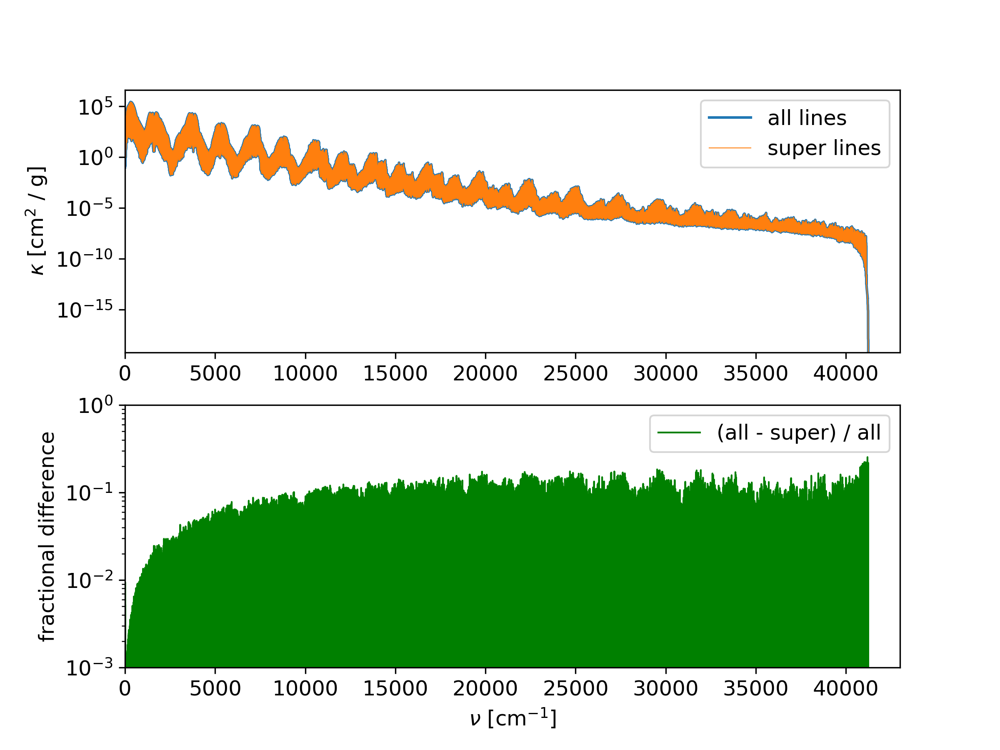

ExoMol super-lines
------------------

Step 1, Species Properties
~~~~~~~~~~~~~~~~~~~~~~~~~~

The HELIOS-K repository provides a file called ``Exomol_species.dat``.
This file contains all available species from the ExoMol database. The
file format is:

``Molecule name , Isotopologue name, Full name, path on exomol.com, range of *.trans files, number of *.trans files, number of digits in *.trans file ranges.``

The full name of the species contains the isotopologue and the line list
name. This full name should be used when as species name for the
opacity calculation, e.g. ``1H2-16O__BT2``.

The ``Exomol_species.dat`` file can be recreated or updated by running:

::

   python3 exomol2.py

Step 2, Download the files and create the ``<species_name>.param`` file
~~~~~~~~~~~~~~~~~~~~~~~~~~~~~~~~~~~~~~~~~~~~~~~~~~~~~~~~~~~~~~~~~~~~~~~

The ExoMol super line files can be downloaded with the a python script as:

::

   python3 exomol.py -M <id> -D 3 -Temp <T>

where ``<id>`` is the full species name e.g. ``1H2-16O__POKAZATEL``.
The ``-D 3`` specifies to download the super-lines instead of the full
transition and states files. The ``<T>`` specifies the temperature of
the super lines in K, e.g. ``-Temp 1000``. When multiple temperatures
are needed, the each temperature file must be downloaded and processed
individually. 

The script needs the file ``Exomol_species.dat`` to be availalbe. If this
file needs to be updated, it can be done by running
``python3 exomol2.py``.

The ``exomol.py`` script automatically writes the ``<species_name>.param``
files for each molecule.

Step 3, create the binary files
~~~~~~~~~~~~~~~~~~~~~~~~~~~~~~~

The downloaded line list files must be pre-processed into binary files
with the following code:

::

   ./prepareExomolSuper -M < id >

where < id > is the full super-line file name, e.g. ``1H2-16O__POKAZATEL__00000-41200__1000K_super.``.
After this step, the ``*.super`` files from ExoMol can be deleted.

Step 4, data path
~~~~~~~~~~~~~~~~~

Include the path of the directory, which contains the obtained binary
files, the ``*.pf``\ file and the ``*.param`` file to the HELIOS-K
``param.dat`` file under ``pathToData``.

Running HELIOS-K
~~~~~~~~~~~~~~~~

When running HELIOS-K, the temperature of the calculation must corespond to the 
temparture of the super-lines. Otherwise the result is not not correct. 

   Comparison of the full POKAZATEL 1H2-16O opacity and super-lines for 1000 K.
   The voigt profiles are truncated at 100 cm^-1.
