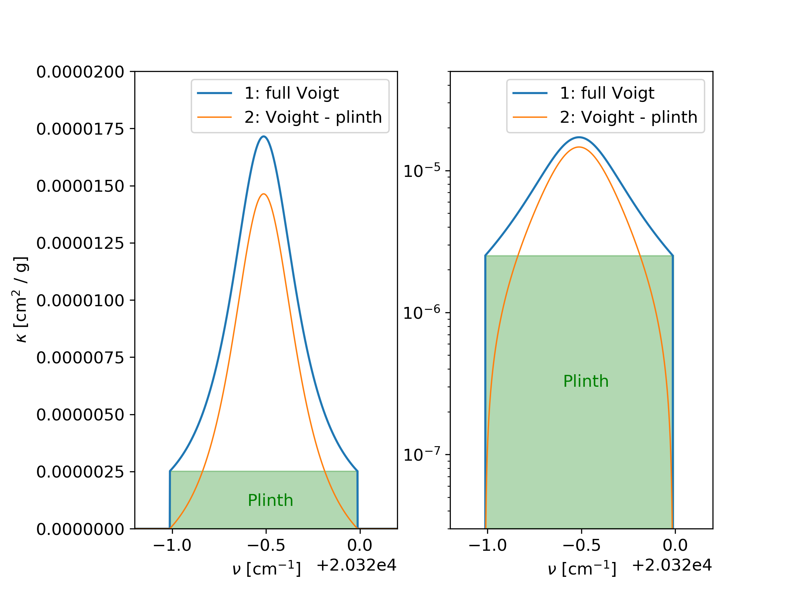

Removing the Plinth
===================

When using cutted line wing profiles in combination with a continuum and
far wing background cross section, it can be necessary to remove the plinth
of each transition line, since this can be already included in the backround. 

|See for example:
|Ptashnik, Igor & McPheat, Robert & Shine, Keith & Smith, Kevin & Williams, Robert. (2012). Water vapour foreign-continuum absorption in near-infrared windows from laboratory measurements. Philosophical transactions. Series A, Mathematical, physical, and engineering sciences. 370. 2557-77. 10.1098/rsta.2011.0218. 
|or
|S.A. Clough, F.X. Kneizys, R.W. Davies,
Line shape and the water vapor continuum,
Atmospheric Research,
Volume 23, Issues 3–4,
1989,
Pages 229-241,
ISSN 0169-8095,
https://doi.org/10.1016/0169-8095(89)90020-3.

| Removing the plinth from the opacities can be done with the `removePlinth` option
in the `param.dat` file. The hight of the plinth is defines as the value of the
line profile at the cutting length. And example is shown in :numref:`fiplinth`.

| Relevant parameters for this example:

 - doStoreFullK = 1
 - removePlinth = 1

 

   The full line profile (blue) is cutted at the a certain cutting length. The value at
   the cutting lenght, defines the value of the plinth, which can be removed from the
   opacity function (orange). Both panels show the same data, the left panel is using
   linear scales, the right panel is using log scale in the y-axis.  
    
