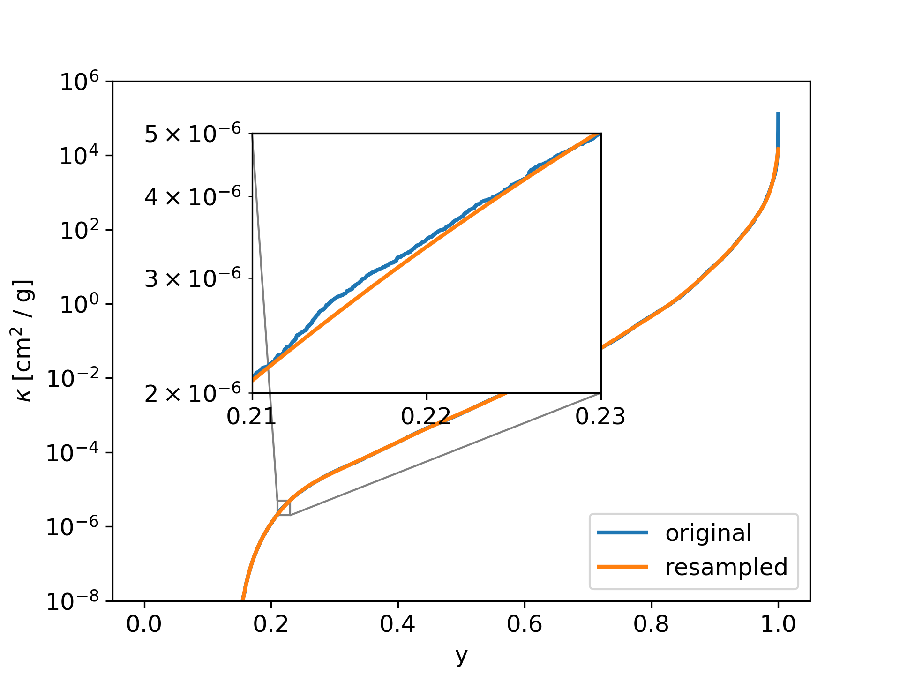

Resampling and k-coefficients
=============================

With the ``doResampling`` option in the ``param.dat`` file, the 
per bin sorted opacity function can be resampled with a Chebyshev 
polynomial. The number of Chebyshev can also be set in the ``param.dat``
file with the ``nC`` option. By using the resampling method,
a lot of storage space can be saved. However, the exact location of
individual transition lines is not contained in the resampled data.
The Chebyshev coefficients are reported the ``Out<name>_cbin.dat``
files.

An example of a resampled bin is shown in :numref:`figresample`.

| relevant parameters for this example:

 - doResampling = 1
 - nC = 20
 - doStoreSK = 2
 - nbins = 1

   The per bin sorted opacity function is resampled with a 
   Chebyshev polynomial, in order so save storage space.

Bins with empty parts
---------------------

Some bins can contain an empty parts, where the opacity function have no transition
lines. This empty parts causes the sorted opacity parts to have a sharp edge between
the empty parts and the rest, as shown in :numref:`figresample2`. Using the
Chebyshev polynomial to resample over these sharp edge would introduce oscillations
into the resampled opacity functions. In order to avoid these oscillations, we resample
only the part of the sorted opacity function, which is not 0 or kmin. That leads
to better results, but when reconstructing the polynomial from the Chebyshev
coefficients, then the empty parts must be added again. 

.. figure:: ../plots/p005/plot001.png  
   :name: figresample2

   Resampling a bin with an empty part. To avoid oscillations in the resampled
   Polynoial, only values > kmin are considered.

Using the Chebyshev coefficients
--------------------------------
 
The resampled opacity function can be reconstruced with the following code:

::

	import numpy as np
	from numpy.polynomial.chebyshev import chebval

	#change here the name of the file
	data_c = np.loadtxt('Out_name_cbin.dat')

	#change here the bin index and the bin size:
	binIndex = 0
	binSize = 300

	#extract Chebyshev coefficients
	c = data_c[binIndex,2:]
	#extract starting point in x of opacity function
	xs = data_c[binIndex,1]

	#rescale x to the standard Chebychev polynomial range [-1:1]
	x1 = x * 2.0 - 1.0
	k_res = chebval(x1,c,tensor=False)
	x2 = x * (1.0 - xs) + xs

	#result is in k_res for x values in x2
	k_res = np.exp(k_res)
	 
