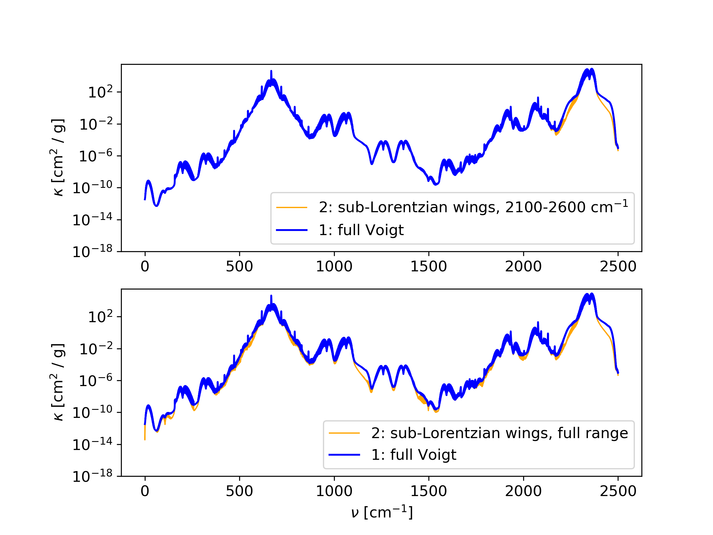

CO2 sub-Lorentzian line wings
=============================

HELIOS-K supports sub-Lorentzian profiles according to the :math:`\chi` factors 
from Perrin and Hartmann 1998. The :math:`\chi` factors are specified in the files
``chiPH89__CO2-CO2.dat`` and ``chiPH89__CO2-N2.dat``. In these files, the affected 
wavenumber range can be set. The ``param.dat`` file contains the option
``subLorentzianfile``, where the file name of the used :math:`\chi` factors file
can be set. If a filename is set there, the sub-Lorentzian line wings are enabled.

In principle, the :math:`\chi` factors can be applied also to other molecules than
CO2, but this is not recommended to do.

M.Y.Perrin and J.M.Hartmann, 1988 (TEMPERATURE-DEPENDENT MEASUREMENTS AND MODELING OF ABSORPTION BY CO2-N2 MIXTURES
IN THE FAR LINE-WINGS OF THE 4.3 # m CO2 BAND).

In :numref:`figSubLorentzian` is shown an example of the sub-Lorentzian profile for CO2.

| Relevant parameters for full Voigt:

 - doStoreFullK = 1
 - cutMode = 0
 - cut = 25.0
 - profile = 1
 - subLorentzianfile = -

| Relevant parameters for sub-Lorentzian Voigt profile in specific wavenumber band:

 - doStoreFullK = 1
 - cutMode = 0
 - cut = 25.0
 - profile = 1
 - subLorentzianfile = chiPH89__CO2-CO2.dat

 - in chiPH89__CO2-CO2.dat:
    - range in cm^-1
    - 2100 2500
 
| Relevant parameters for sub-Lorentzian Voigt profile in the full wavenumber range:

 - doStoreFullK = 1
 - cutMode = 0
 - cut = 25.0
 - profile = 1
 - subLorentzianfile = chiPH89__CO2-CO2.dat

 - in chiPH89__CO2-CO2.dat:
    - range in cm^-1
    - 0 10000

 

   CO2 sub-Lorentzian wings with :math:`\chi` factors for Perrin and Hartmann 1998. Top panel,:
   :math:`\chi` factors applied to the band 2100-2600 cm^-1. Bottom panel: :math:`\chi`  factors
   applied to the full wavenumber range. CO2, Hitran 2016, T = 250 K, P = 2 atm.

